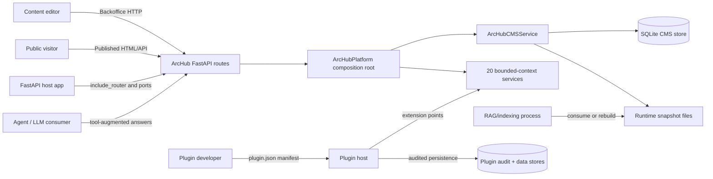
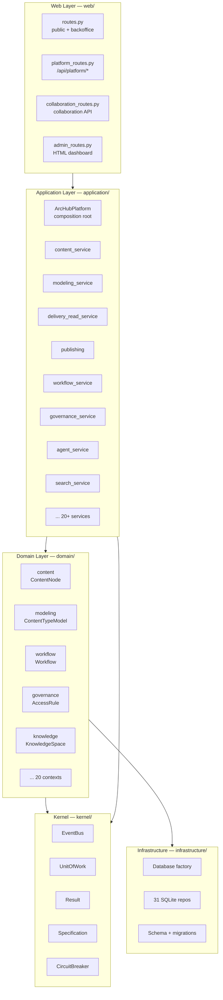
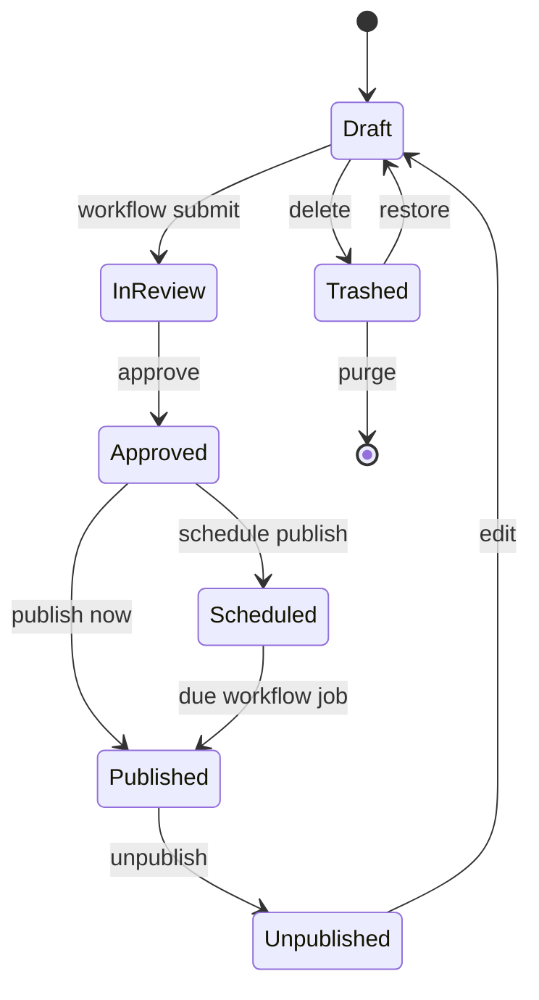
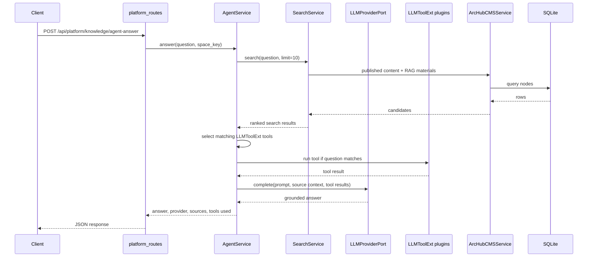

# Architecture

ArcHub CMS is a standalone FastAPI package that provides a backoffice, content
modeling, public delivery, and runtime-content export surface for host
applications. The package is intentionally self-contained: hosts embed the
router and connect authentication, templates, runtime sources, audit, and cache
invalidation through ports.

The codebase follows a DDD (Domain-Driven Design) architecture with 20 bounded
contexts, CQRS-lite application services, a shared kernel, and an executable
plugin runtime.

## System Context

## DDD Layer Architecture

## Bounded Contexts (20)

| Context | Domain | Application service(s) | Key API prefix |
|---|---|---|---|
| content | `ContentNode` aggregate | `content_service` | (internal) |
| knowledge | spaces/docs, RAG | `agent_service`, `knowledge` | `/api/platform/knowledge/*` |
| collaboration | comments/mentions/reactions | `collaboration_service` | `/api/platform/collaboration/*` |
| modeling | content types/fields | `modeling_service` | `/api/platform/modeling/*` |
| delivery | sitemap/feed/tags/redirects | `delivery_read_service` | `/api/platform/delivery/*` |
| versioning | history + diff + restore | `versioning_service` | `/api/platform/versioning/*` |
| governance | RBAC + access policy | `governance_service` | `/api/platform/governance/*` |
| workflow | review/approval state machine | `workflow_service` | `/api/platform/workflow/*` |
| media | assets + pluggable storage | `media_service` | `/api/platform/media/*` |
| packaging | export/import bundles | `packaging_service` | `/api/platform/packaging/*` |
| graph | backlinks/metrics/canvas | `graph_service` | `/api/platform/graph/*` |
| runtime | RAG export/snapshot | `runtime_service` | `/api/platform/runtime/*` |
| localization | culture variants + dictionary | `localization_service` | `/api/platform/localization/*` |
| analytics | health/audit/activity | `analytics_service` | `/api/platform/analytics/*` |
| webhooks | outbox + notification | `webhooks_service` | `/api/platform/webhooks/*` |
| search | federated + faceted + FTS5 | `search_service`, `fts_search_service` | `/api/platform/search` |
| subscriptions | watchers + inbox | `subscription_service` | `/api/platform/subscriptions/*` |
| blueprints | starter content templates | `blueprint_service` | `/api/platform/blueprints/*` |
| locks | edit reservation | `lock_service` | `/api/platform/locks/*` |
| trash | recycle bin | `trash_service` | `/api/platform/trash/*` |

## Internal Modules

| Module | Responsibility | Key files |
|---|---|---|
| Web routes | Admin UI, JSON management APIs, preview, public HTML, feed, sitemap, and delivery APIs. | `web/routes.py`, `platform_routes.py`, `collaboration_routes.py`, `admin_routes.py` |
| CMS service | Legacy monolithic service still used as SQLite persistence engine. | `services/cms.py` |
| Content Builder | Block registry, blueprint catalog, JSON normalization, previews, audit, and public HTML rendering. | `services/content_builder.py` |
| Runtime helpers | Imports host runtime materials and exports published snapshots. | `services/runtime.py` |
| Application layer | 20+ bounded-context CQRS services wired by `ArcHubPlatform`. | `application/*.py` |
| Domain layer | Aggregates, value objects, domain events, repository ports for each context. | `domain/*/` |
| Kernel | Shared primitives: EventBus, UnitOfWork, Result, Specification, CircuitBreaker. | `kernel/*.py` |
| Extensibility | Plugin host with 25 extension point protocols, platform adapter, and plugin audit log. | `extensibility/*.py` |
| Integration ports | Stable host extension contracts. | `ports.py` |
| RAG integration | Corpus registry and external-indexer hook. | `integrations/rag.py` |

## Architectural Patterns

- **Bounded Contexts** — 20 domain subdirectories with isolated aggregates and repository ports
- **Hexagonal Ports & Adapters** — Protocol-based repos + `ports.py` host contracts
- **CQRS-lite** — Separate Query/Command service pairs (e.g. `WorkflowQueryService` + `WorkflowCommandService`)
- **Repository Pattern** — `@runtime_checkable` Protocol ports per context, 31 SQLite implementations
- **Unit of Work** — `SqliteUnitOfWork` with post-commit event publishing
- **Domain Events + Event Bus** — `EventBus` with exact + wildcard subscriptions
- **Specification Pattern** — Composable predicates with `&`, `|`, `~` operators
- **Strategy Pattern** — `EmbeddingPort`, `LLMProviderPort`, `SearchPort` pluggable implementations
- **Circuit Breaker** — `ResilientLLMProvider` wraps online/offline LLM failover
- **Plugin/SPI** — 25 extension point protocols, `PluginHost` lifecycle, permission gating
- **Audited Plugin Persistence** — executable plugins write only through `PluginPlatformAdapter` and platform-owned SQL repositories
- **Composition Root** — `ArcHubPlatform` facade wiring all contexts
- **State Machine** — `Workflow` with explicit transition table
- **Outbox Pattern** — Webhooks with delivery records and dispatch
- **Result Type** — `Ok`/`Err` for domain validation

## Request Surfaces

The admin surface starts at `/admin/archub` and includes model, content,
workflow, package, preview-token, access, lock, media, dictionary, webhook, and
runtime actions. The platform API surface starts at `/api/platform` and exposes
JSON endpoints for all 20 bounded contexts. The delivery surface starts at
`/cms` and exposes HTML pages, `/cms/api/tree`, `/cms/api/content`,
`/cms/api/search`, tags, RSS, sitemap, and preview-token resolution. The
collaboration surface starts at `/api/platform/collaboration` for comments,
mentions, and reactions.

## Related Architecture Pages

- [Advanced CMS Refactor](architecture/advanced-cms-refactor.md) documents the
  Umbraco-inspired target architecture and refactoring strategy.
- [Bounded Contexts](architecture/contexts.md) documents all 20 DDD contexts,
  legacy facade consolidation, and architectural patterns.
- [CMS Capability Matrix](architecture/capability-matrix.md) maps ArcHub
  capabilities to Umbraco, Strapi, Contentful, and Sanity patterns.
- [Enterprise Knowledge Platform](architecture/enterprise-knowledge-platform.md)
  documents the DDD knowledge-base context, plugin manifests, graph export, and
  offline/online LLM ports.
- [Plugin Platform Adapter](architecture/plugin-platform-adapter.md) documents
  the SQLite/PostgreSQL plugin persistence boundary and `archub_plugin_audit`.
- [Content Modeling](architecture/content-modeling.md) documents schema-driven
  data types, templates, document types, compositions, and blueprints.
- [Versioning & Cleanup](architecture/versioning-cleanup.md) documents content
  history, rollback, and retention cleanup commands.
- [Publishing & Workflow](architecture/publishing-workflow.md) documents
  lifecycle commands, domain events, and runtime export side effects.
- [Media & DAM](architecture/media-dam.md) documents media policy, folder
  reports, duplicate detection, usage reports, and orphaned assets.
- [Package Promotion](architecture/package-promotion.md) documents package
  export, inspection, dry-run import plans, and promotion events.
- [Webhook Integrations](architecture/webhook-integrations.md) documents
  webhook subscriptions, delivery logs, signed dispatch, and retry handling.
- [Governance & Access](architecture/governance-access.md) documents editor
  permissions, public access policies, member gating, and route guards.
- [Runtime & Data](architecture/runtime-and-data.md) documents SQLite state,
  runtime snapshots, delivery caching, and operational flows.
- [Delivery Contracts](architecture/delivery-contracts.md) documents the
  headless delivery API parameters, projection semantics, and public access.
- [Diagrams & Models](architecture/diagrams.md) documents Mermaid, PlantUML,
  Archi/ArchiMate, and Structurizr source files.

## Content Lifecycle

Publishing validates draft payloads against the content type schema, writes
published JSON, appends a version, records activity, publishes domain events
through the EventBus, enqueues matching webhooks, and refreshes runtime exports
when runtime-managed content changes.

## Agent-Service Flow

## Plugin System

The plugin system supports 25 extension point protocols:

| Extension Point | Purpose |
|---|---|
| `EventHookExt` | Subscribe to domain events |
| `SearchExt` | Contribute scored search hits |
| `LLMToolExt` | Agent-callable tools |
| `RendererExt` | Whole-body content rendering |
| `MacroExt` | `{{macro_name}}` expansion |
| `ImporterExt` | Bulk document import (e.g. markdown) |
| `ExporterExt` | Bulk document export |
| `AuthExt` | Resolve identity from request |
| `StorageExt` | Read/write blob storage |
| `NotificationExt` | Outbound channels (Slack, email) |
| `ThemeExt` | Theme/layout overrides |
| `ScheduledJobExt` | Plugin-defined scheduled jobs |
| `AnalyticsProviderExt` | Analytics collectors and reports |
| `WorkflowActionExt` | Custom workflow actions/triggers |
| `ContentTransformerExt` | Publish/render pipeline transformations |
| `SearchIndexerExt` | External search index synchronization |
| `SecurityPolicyExt` | Governance checks for publish/access |
| `EditorExt` | Custom editor surfaces |
| `ConnectorExt` | External system connectors |
| `ChatHandlerExt` | Custom chat handlers |
| `DashboardWidgetExt` | Admin dashboard widgets |
| `ExportFormatExt` | Format-specific export providers |
| `ImportFormatExt` | Format-specific import providers |
| `LiveEditExt` | Collaborative/live edit providers |
| `PageActionExt` | Page context actions |
| `Plugin` | Base protocol |

Plugins are discovered from `ARCHUB_PLUGIN_DIRS` or `plugins/`. A plugin is a
JSON manifest named `plugin.json` or `*.archub-plugin.json`. The `PluginHost`
lifecycle is: discover → permission-check → load → wire. Two loader runtimes:
in-process Python entrypoints and sandboxed HTTP tools. In-process plugins do
not receive database handles; persistent plugin state must go through
`context.platform` and the platform-owned adapter/repository layer.

## Extension Boundary

Production hosts should keep domain behavior outside this package. Implement
`AuthPort` for editor/member identity, `TemplatePort` for host layouts,
`RuntimeSourcePort` for domain resources, `CacheInvalidationPort` for process
caches, `AuditSink` for structured audit events, `LLMProviderPort` for LLM
completions, `EmbeddingPort` for vector embeddings, and `SearchPort` for vector
search. The package must not import host applications such as bot runtime
packages directly.

## Quality Attributes

- **Embeddability:** FastAPI hosts can include `archub_cms.web.routes.router` or
  create the standalone app with `create_archub_app()`.
- **Portability:** SQLite and local filesystem exports keep demos and tests
  simple; storage logic is centralized through repository ports.
- **Delivery performance:** Public JSON responses use stable ETags,
  `Last-Modified`, and cache-control headers.
- **Governance:** Permissions, public access rules, locks, workflow, previews,
  versions, audit activity, and webhooks are part of the core service.
- **Extensibility:** 25 plugin extension points with manifest validation,
  permission gating, audited config, and platform-owned persistence adapters.
