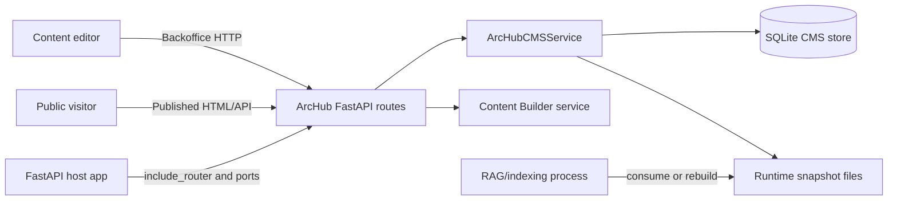
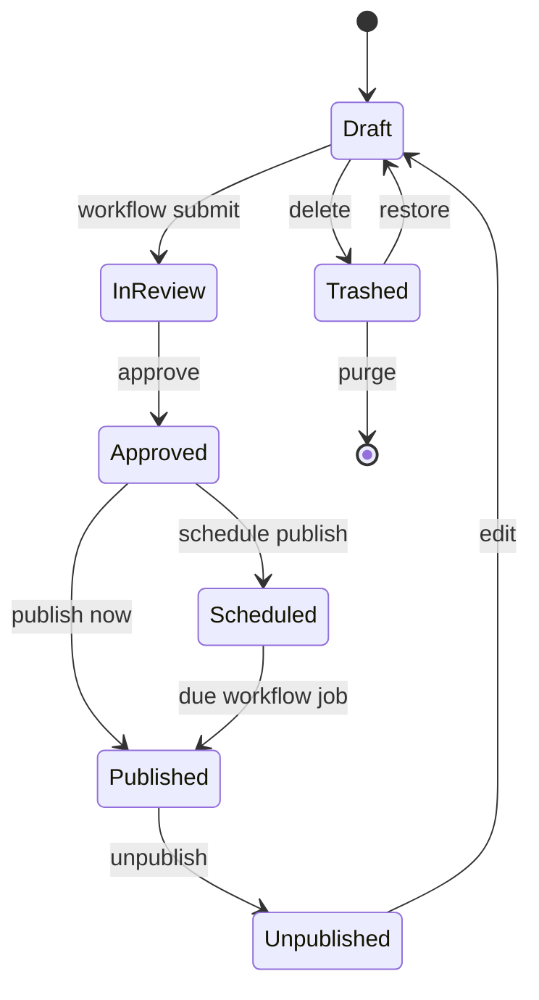

# Architecture

ArcHub CMS is a standalone FastAPI package that provides a backoffice, content
modeling, public delivery, and runtime-content export surface for host
applications. The package is intentionally self-contained: hosts embed the
router and connect authentication, templates, runtime sources, audit, and cache
invalidation through ports.

## System Context

## Internal Modules

| Module | Responsibility | Key files |
|---|---|---|
| Web routes | Admin UI, JSON management APIs, preview, public HTML, feed, sitemap, and delivery APIs. | `src/archub_cms/web/routes.py`, `_common.py` |
| CMS service | Content types, data types, templates, tree state, versions, permissions, locks, workflow, redirects, domains, webhooks, delivery payloads, packages, runtime exports. | `src/archub_cms/services/cms.py` |
| Content Builder | Block registry, blueprint catalog, JSON normalization, previews, audit, and public HTML rendering. | `src/archub_cms/services/content_builder.py` |
| Runtime helpers | Imports host runtime materials and exports published snapshots. | `src/archub_cms/services/runtime.py` |
| Integration ports | Stable host extension contracts. | `src/archub_cms/ports.py` |
| RAG integration | Corpus registry and external-indexer hook. | `src/archub_cms/integrations/rag.py` |

## Request Surfaces

The admin surface starts at `/admin/archub` and includes model, content,
workflow, package, preview-token, access, lock, media, dictionary, webhook, and
runtime actions. The delivery surface starts at `/cms` and exposes HTML pages,
`/cms/api/tree`, `/cms/api/content`, `/cms/api/search`, tags, RSS, sitemap, and
preview-token resolution.

## Related Architecture Pages

- [Advanced CMS Refactor](architecture/advanced-cms-refactor.md) documents the
  Umbraco-inspired target architecture and refactoring strategy.
- [CMS Capability Matrix](architecture/capability-matrix.md) maps ArcHub
  capabilities to Umbraco, Strapi, Contentful, and Sanity patterns.
- [Publishing & Workflow](architecture/publishing-workflow.md) documents
  lifecycle commands, domain events, and runtime export side effects.
- [Runtime & Data](architecture/runtime-and-data.md) documents SQLite state,
  runtime snapshots, delivery caching, and operational flows.
- [Diagrams & Models](architecture/diagrams.md) documents Mermaid, PlantUML,
  Archi/ArchiMate, and Structurizr source files.

## Content Lifecycle

Publishing validates draft payloads against the content type schema, writes
published JSON, appends a version, records activity, enqueues matching webhooks,
and refreshes runtime exports when runtime-managed content changes.

## Extension Boundary

Production hosts should keep domain behavior outside this package. Implement
`AuthPort` for editor/member identity, `TemplatePort` for host layouts,
`RuntimeSourcePort` for domain resources, `CacheInvalidationPort` for process
caches, and `AuditSink` for structured audit events. The package must not import
host applications such as bot runtime packages directly.

## Quality Attributes

- **Embeddability:** FastAPI hosts can include `archub_cms.web.routes.router` or
  create the standalone app with `create_archub_app()`.
- **Portability:** SQLite and local filesystem exports keep demos and tests
  simple; storage logic is centralized in `ArcHubCMSService`.
- **Delivery performance:** Public JSON responses use stable ETags,
  `Last-Modified`, and cache-control headers.
- **Governance:** Permissions, public access rules, locks, workflow, previews,
  versions, audit activity, and webhooks are part of the core service.
