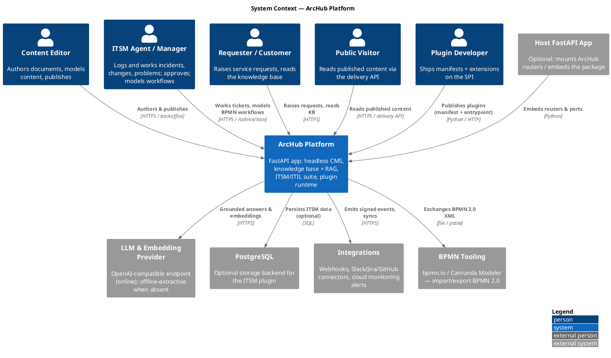
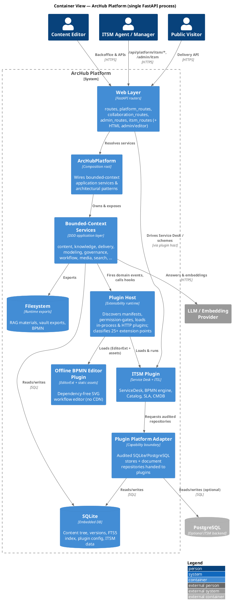
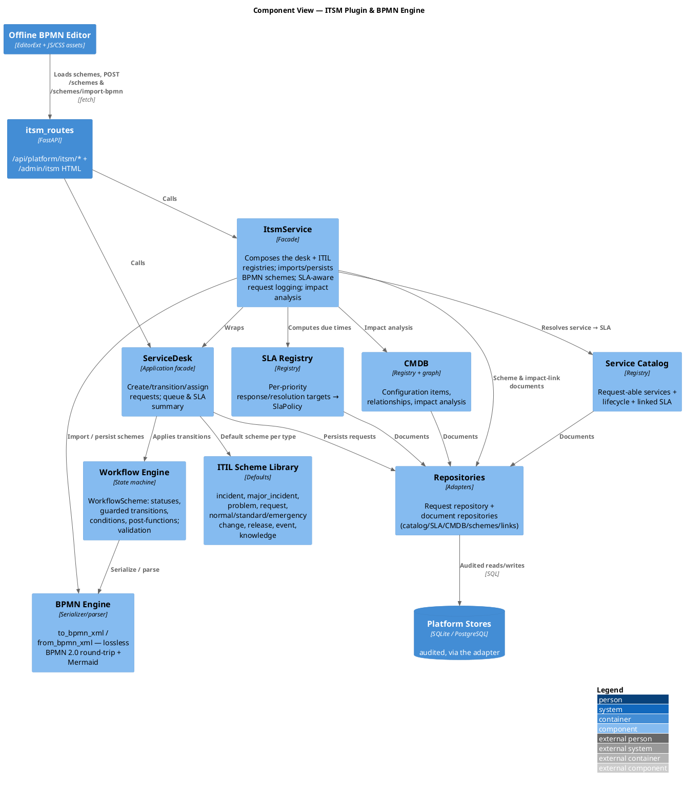
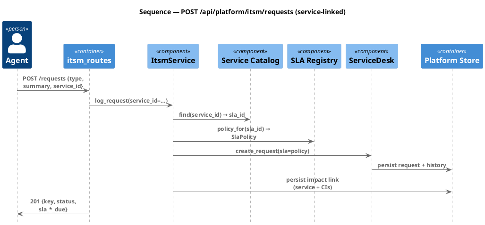

# C4 Architecture Model

This page documents the ArcHub platform with the [C4 model](https://c4model.com/)
(Context → Container → Component) using **PlantUML C4**. The diagrams render through
the configured PlantUML server; the same sources are committed under
`docs/diagrams/c4/*.puml` so you can render them offline with the `plantuml` CLI:

```bash
plantuml -tsvg docs/diagrams/c4/*.puml
```

ArcHub is a single, embeddable Python package (`archub_cms`) exposing a FastAPI app.
It is organized as a **hexagonal + DDD** core (bounded-context application services
behind ports), a **plugin runtime** (in-process and HTTP/sandboxed), and a set of
**productized capabilities** — headless CMS, enterprise knowledge base with offline +
online RAG, and a full **ITSM/ITIL** suite (Service Desk, BPMN workflow engine, Service
Catalog, SLA and CMDB).

---

## Level 1 — System Context



---

## Level 2 — Containers

The whole platform ships as one process, but it is cleanly layered. The "containers"
below are logical runtime units inside the `archub_cms` package.



---

## Level 3 — Components (ITSM plugin)

A zoom into the ITSM/ITIL capability — the workflow/BPMN engine and the ITIL
registries — and how the offline editor and REST API drive it.



---

## Runtime sequence — raise an incident under an SLA



See [ITSM / ITIL](../capabilities/itsm.md) for the full capability documentation and
[Bounded Contexts](contexts.md) for the CMS/knowledge core.
