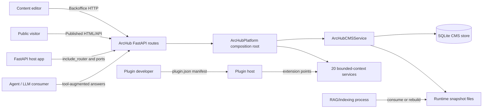
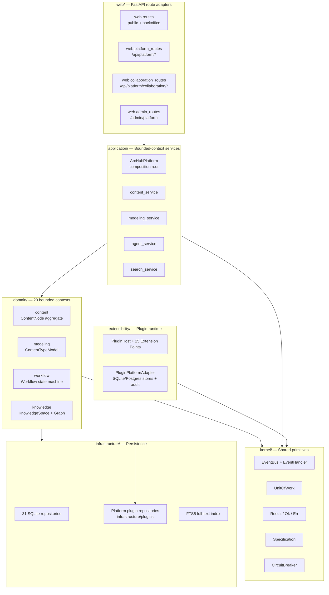
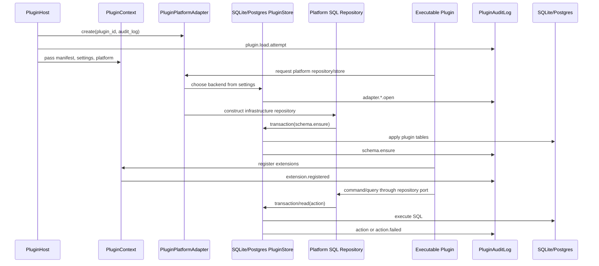

# Diagrams & Models

Architecture model sources live under `docs/diagrams/`. Mermaid diagrams are
embedded in MkDocs pages. PlantUML, Archi/ArchiMate, and Structurizr files are
kept as renderable source artifacts so contributors can regenerate images or
import the model into their preferred tool.

## Source Inventory

| Format | Files | Use |
|---|---|---|
| Mermaid | `docs/diagrams/mermaid/*.mmd` | Quick rendered diagrams in MkDocs and GitHub previews, including plugin persistence flow. |
| PlantUML | `docs/diagrams/plantuml/*.puml` | System context, container, DDD layers, modularization, publishing, delivery, media, package, plugin, agent, platform, audit, and maintenance diagrams. |
| Archi/ArchiMate | `docs/diagrams/archi/*` | ArchiMate layer view and CSV import model for Archi users. |
| Structurizr | `docs/diagrams/structurizr/workspace.dsl` | C4-style model for system context, container, platform services, web routes, and plugin system views. |

## Rendering Commands

```bash
# Mermaid CLI, if installed
mmdc -i docs/diagrams/mermaid/container.mmd -o site/container.svg

# PlantUML, if installed
plantuml -tsvg docs/diagrams/plantuml/*.puml

# Structurizr CLI, if installed
structurizr validate -workspace docs/diagrams/structurizr/workspace.dsl
```

## Mermaid Diagrams

### System Context



### Container View



### Plugin Platform Adapter



### Bounded Contexts

```mermaid
flowchart TB
    subgraph Content["Content & Modeling"]
        content[content\nContentNode aggregate\nSlug, RoutePath, Culture]
        modeling[modeling\nContentTypeModel, DataType, Template]
        blueprints[blueprints\nBlueprint aggregate]
        versioning[versioning\nVersion + VersionDiff]
        localization[localization\nDictionaryEntry + LocalizedVariant]
    end

    subgraph Publishing["Publishing & Workflow"]
        workflow[workflow\nWorkflow state machine\nDraft→Review→Approved→Scheduled→Published]
        delivery[delivery\nRedirect + PublishedDocument]
        runtime[runtime\nRuntimeSnapshot + ExportStatus]
        trash[trash\nTrashedItem]
    end

    subgraph Governance["Governance & Access"]
        governance[governance\nAccessRule + PermissionRule\nRBAC + public access]
        locks[locks\nEditLock aggregate]
        subscriptions[subscriptions\nSubscription aggregate]
    end

    subgraph Knowledge["Knowledge & Intelligence"]
        knowledge[knowledge\nKnowledgeSpace, Document\nGraph, Answer, Source]
        search[search\nSearchQuery + Facets]
        graph[graph\nGraphMetrics + Canvas]
        analytics[analytics\nHealthReport + ActivityEntry]
    end

    subgraph Integration["Integration & Extensibility"]
        webhooks[webhooks\nWebhook + DeliveryRecord]
        packaging[packaging\nContentPackage + Inspection]
        media[media\nMediaAsset aggregate]
        plugins[plugins\nPluginManifest + capabilities]
    end

    subgraph Collaboration["Collaboration"]
        collaboration[collaboration\nComment aggregate\nMention + Reaction]
    end
```

## Structurizr Scope

The Structurizr workspace models ArcHub CMS as a software system with containers
for the legacy routes, platform routes, collaboration routes, admin dashboard,
ArcHubPlatform composition root, all 20 bounded-context application services,
plugin host, event bus, unit of work, legacy CMS service, host integration ports,
templates/static assets, SQLite store, FTS5 index, runtime snapshot files, and
plugin manifests. It shows external actors: content editors, public visitors,
host applications, plugin developers, agent/LLM clients, and downstream
runtime/indexing processes. The plugin-system view also includes the
`PluginPlatformAdapter`, plugin SQL repositories, plugin audit log, and plugin
data store.

Four views are defined:
- **SystemContext** — external actors and ArcHub CMS boundary
- **Containers** — all containers and their relationships
- **PlatformServices** — ArcHubPlatform and all bounded-context services
- **WebRoutes** — route adapters and their dependencies
- **PluginSystem** — plugin host, extension points, and data stores

## Archi/ArchiMate Scope

The ArchiMate model describes three layers:

- **Business**: content editor, public visitor, plugin developer, agent/LLM client,
  and runtime consumer roles. Business services: backoffice, delivery, knowledge
  platform, and collaboration.
- **Application**: ArcHubPlatform composition root, 20 application services,
  plugin host, legacy CMS service, admin dashboard, platform JSON API,
  collaboration API, and host integration ports.
- **Technology/data**: FastAPI process, SQLite database, FTS5 index, static assets,
  runtime snapshot filesystem, plugin config store, plugin audit log, and plugin
  data store.

Use `docs/diagrams/archi/elements.csv` and
`docs/diagrams/archi/relationships.csv` as a compact Archi import starting
point, or render the ArchiMate PlantUML source directly.

## PlantUML Source Set

### Structural diagrams

- `system-context.puml`: external actors, plugin developers, agent clients, and
  ArcHub CMS boundary with platform API surfaces.
- `container.puml`: DDD layer architecture with all containers, domain contexts,
  kernel, extensibility, and infrastructure.
- `advanced-cms-layers.puml`: detailed DDD layer architecture showing every
  layer, every domain context, every kernel primitive, and all infrastructure
  repositories.
- `target-modularization.puml`: current modularization showing 20 domain
  contexts, their application services, and the legacy CMS service compatibility
  layer.
- `platform-composition-root.puml`: ArcHubPlatform composition root wiring all
  bounded-context services onto shared CMS, EventBus, and PluginHost.

### Flow diagrams

- `publish-flow.puml`: editor publish command through validation, versioning,
  webhooks, and runtime export.
- `content-model-update-flow.puml`: content model update sequence and future
  event-handler hooks.
- `content-modeling-service.puml`: schema-driven modeling boundary for data
  types, templates, content types, compositions, and blueprints.
- `delivery-application-service.puml`: current route-to-application-service
  delivery boundary.
- `delivery-projection-flow.puml`: `fields`, `expand`, culture/segment, and
  public access request flow.
- `publishing-application-service.puml`: lifecycle command boundary for
  publish, workflow, trash, and runtime side effects.
- `domain-events-flow.puml`: future event-handler direction for audit,
  webhooks, cache invalidation, indexing, and runtime export.
- `versioning-service.puml`: content history, rollback, and retention cleanup
  application boundary.
- `version-cleanup-flow.puml`: keep-latest and age-based pruning sequence.
- `webhook-application-service.puml`: webhook management and maintenance
  dispatch application boundary.
- `webhook-dispatch-flow.puml`: durable webhook delivery, retry, and failure
  state transitions.
- `public-access-flow.puml`: member-gated public delivery decision flow.

### Knowledge and intelligence diagrams

- `enterprise-knowledge-platform.puml`: DDD knowledge-base boundary with plugin
  registry and LLM ports.
- `knowledge-answer-flow.puml`: retrieval, RAG source merge, and grounded answer
  sequence.
- `agent-resilient-llm.puml`: AgentService tool-augmented answering with
  ResilientLLM circuit breaker, offline/online providers, and embedding
  strategies.

### Plugin and platform diagrams

- `plugin-system-architecture.puml`: PluginHost lifecycle, 25 extension point
  protocols, permission gate, config store, platform adapter, audit log, and loaders.
- `plugin-manifest-lifecycle.puml`: manifest validation and runtime binding.
- `plugin-platform-adapter.puml`: executable plugin persistence boundary,
  SQLite/PostgreSQL adapter selection, SQL repository calls, and audit logging.
- `core-plugin-distribution.puml`: Rust core plugin manifest, workspace
  coverage, marketplace packaging, and install flow.
- `php-wiki-plugin.puml`: ArcHub.ru external PHP wiki plugin, Symfony service
  boundary, Draw.io-compatible diagram surface, and ArcHub plugin bridge.
- `sdk-release-architecture.puml`: ArcHub SDK release artifacts, Python client,
  OpenAPI contract, plugin manifest builder, and platform API groups.

### Service boundary diagrams

- `published-helper.puml`: `ArcHubContentHelper` and `PublishedContent` facade.
- `maintenance-jobs.puml`: scheduled publishing, webhook dispatch, runtime
  export, and health reporting.
- `media-library-service.puml`: media policy and report application boundary.
- `media-usage-report.puml`: usage, duplicate, folder, and orphaned asset
  report generation.
- `package-promotion-service.puml`: package export/import application service
  boundary and event flow.
- `package-import-plan.puml`: package dry-run planning and import sequence.
- `governance-service.puml`: editor permissions, public access route guards,
  and governance domain events.
