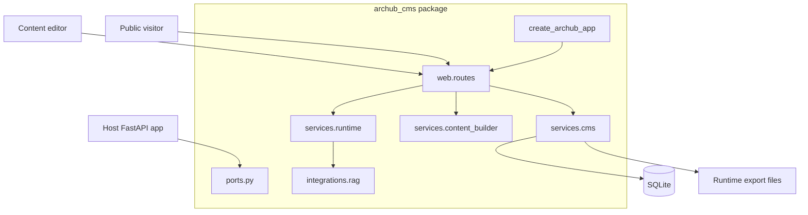

# Diagrams & Models

Architecture model sources live under `docs/diagrams/`. Mermaid diagrams are
embedded in MkDocs pages. PlantUML, Archi/ArchiMate, and Structurizr files are
kept as renderable source artifacts so contributors can regenerate images or
import the model into their preferred tool.

## Source Inventory

| Format | Files | Use |
|---|---|---|
| Mermaid | `docs/diagrams/mermaid/*.mmd` | Quick rendered diagrams in MkDocs and GitHub previews. |
| PlantUML | `docs/diagrams/plantuml/*.puml` | System context, container, publishing, target modularization, helper, and maintenance diagrams. |
| Archi/ArchiMate | `docs/diagrams/archi/*` | ArchiMate layer view and CSV import model for Archi users. |
| Structurizr | `docs/diagrams/structurizr/workspace.dsl` | C4-style model for system context and container views. |

## Rendering Commands

```bash
# Mermaid CLI, if installed
mmdc -i docs/diagrams/mermaid/container.mmd -o site/container.svg

# PlantUML, if installed
plantuml -tsvg docs/diagrams/plantuml/*.puml

# Structurizr CLI, if installed
structurizr validate -workspace docs/diagrams/structurizr/workspace.dsl
```

## Mermaid Container View



## Structurizr Scope

The Structurizr workspace models ArcHub CMS as a software system with containers
for the router, CMS service, Content Builder, runtime helpers, RAG registry,
templates/static assets, SQLite store, and runtime snapshot files. It also shows
external actors: content editors, public visitors, host applications, and
downstream runtime/indexing processes.

## Archi/ArchiMate Scope

The ArchiMate model describes three layers:

- Business: content editor, public visitor, and runtime consumer roles.
- Application: admin service, delivery service, CMS service, Content Builder,
  runtime export service, and port contracts.
- Technology/data: FastAPI process, SQLite database, static assets, and runtime
  snapshot filesystem.

Use `docs/diagrams/archi/elements.csv` and
`docs/diagrams/archi/relationships.csv` as a compact Archi import starting
point, or render the ArchiMate PlantUML source directly.

## PlantUML Source Set

- `system-context.puml`: external actors and ArcHub CMS boundary.
- `container.puml`: package-level components and data stores.
- `publish-flow.puml`: editor publish command through validation, versioning,
  webhooks, and runtime export.
- `advanced-cms-layers.puml`: target clean architecture layers.
- `target-modularization.puml`: gradual breakup of the monolithic CMS service.
- `published-helper.puml`: `ArcHubContentHelper` and `PublishedContent` facade.
- `maintenance-jobs.puml`: scheduled publishing, webhook dispatch, runtime
  export, and health reporting.
