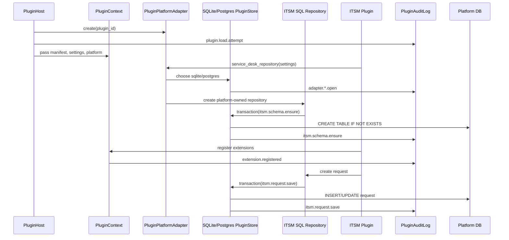

# Plugin Platform Adapter & Audit

ArcHub executable plugins must not persist directly to SQLite or PostgreSQL.
The platform owns database connections, migrations, transaction boundaries, and
audit logging. Plugins receive only the narrow `PluginContext` surface and ask
`context.platform` for approved persistence adapters.

## Architecture Decision

`PluginHost` creates one `PluginPlatformAdapter` per loaded plugin. The adapter
is passed into `PluginContext` and becomes the only approved write path for
plugin-owned data. Plugin packages may define repository ports and domain
logic, but SQL implementations live under `infrastructure/plugins/`.

This keeps plugin code portable and auditable:

- Plugin code depends on `RequestRepository` or another plugin-facing port.
- Platform infrastructure chooses SQLite or PostgreSQL from settings.
- Every adapter transaction writes an `archub_plugin_audit` record.
- Failed transactions write a `*.failed` audit action before re-raising.
- PostgreSQL DSNs are redacted before audit metadata is stored.

## Runtime Components

| Component | Responsibility |
|---|---|
| `PluginHost` | Discovers, permission-checks, loads, wires, and audits plugin lifecycle. |
| `PluginContext` | Provides manifest, settings, event subscription, registration, and `platform`. |
| `PluginPlatformAdapter` | Capability boundary exposed to plugins; creates audited stores/repositories. |
| `SQLitePluginStore` | Platform-owned SQLite transaction/read adapter. |
| `PostgresPluginStore` | Platform-owned PostgreSQL transaction/read adapter. |
| `PluginAuditLog` | Writes immutable plugin actions to `archub_plugin_audit`. |
| `infrastructure/plugins/*` | SQL repositories that use platform stores, not plugin-owned connections. |

## Persistence Rules

Allowed:

- `context.platform.service_desk_repository(context.settings)`
- `context.platform.sqlite_store(purpose="my.plugin")`
- `context.platform.postgres_store(dsn=dsn, purpose="my.plugin")`
- Repository ports implemented in `infrastructure/plugins/`

Forbidden inside executable plugin packages:

- Constructing `Database(...)`
- Importing `sqlite3`, `psycopg`, or raw connection factories
- Calling `commit()` outside a platform store
- Writing plugin state without a matching audit action

## Audit Events

The current platform writes these event families:

| Event family | Example |
|---|---|
| Lifecycle | `plugin.load.attempt`, `plugin.setup.attempt`, `plugin.loaded` |
| Registration | `extension.registered`, `event.subscribed` |
| Configuration | `plugin.config.enabled`, `plugin.config.settings` |
| Adapter open | `adapter.sqlite.open`, `adapter.postgres.open` |
| Repository schema | `itsm.schema.ensure` |
| Repository commands | `itsm.request.next_key`, `itsm.request.save` |
| Repository queries | `itsm.request.get`, `itsm.request.list` |
| Host-mediated actions | `search.query`, `macro.expand`, `llm_tool.run`, `importer.run` |
| Failures | Any action with `.failed` suffix and error metadata |

## ITSM Flow

## Storage Selection

ITSM uses SQLite by default and PostgreSQL when plugin settings specify
`storage: postgres`. PostgreSQL requires a `dsn`/`postgres_dsn` setting or
`ARCHUB_ITSM_PG_DSN`, plus the optional `archub-cms[postgres]` dependency.

SQLite remains the default because it matches standalone ArcHub operation and
test fixtures. PostgreSQL is the multi-node adapter path and uses the same
logical request schema.

## Diagram Sources

- Mermaid: `docs/diagrams/mermaid/plugin-platform-adapter.mmd`
- PlantUML: `docs/diagrams/plantuml/plugin-platform-adapter.puml`
- ArchiMate: `docs/diagrams/archi/archimate-view.puml`
- Structurizr: `docs/diagrams/structurizr/workspace.dsl`
