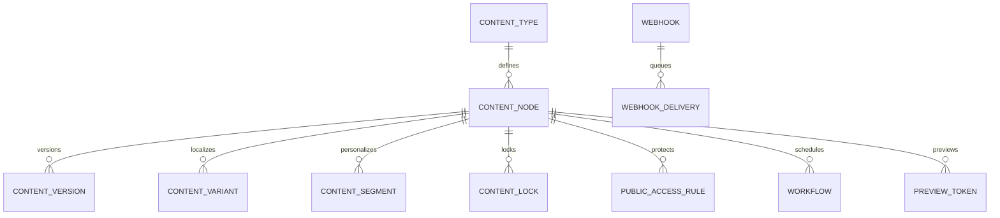
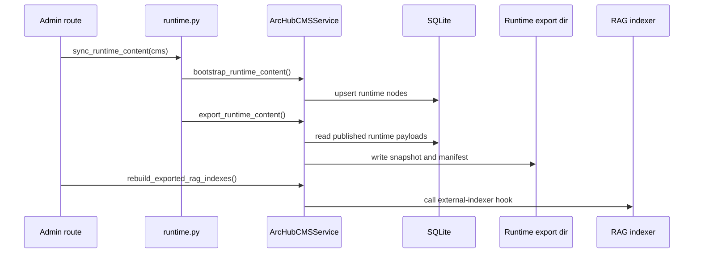

# Runtime & Data Architecture

ArcHub CMS stores editorial state in SQLite and exports selected published
content into filesystem snapshots for downstream runtime consumers.

## Configuration

| Variable | Default | Purpose |
|---|---|---|
| `ARCHUB_CMS_DB` | `data/archub_cms.db` | SQLite database path used by `ArcHubCMSService`. |
| `ARCHUB_RUNTIME_EXPORT_DIR` | `data/archub_runtime` | Runtime snapshot output directory. |
| `ARCHUB_PUBLIC_ROOT` | `/cms` | Public delivery root. |
| `ARCHUB_DELIVERY_CACHE_MAX_AGE` | `60` | Public max-age seconds. |
| `ARCHUB_DELIVERY_CACHE_STALE_REVALIDATE` | `300` | Stale-while-revalidate seconds. |

## Persistence Model

The service persists document types, data types, templates, compositions,
blueprints, content nodes, variants, segments, permissions, public access rules,
domains, redirects, versions, locks, activity, media references, dictionary
items, webhooks, workflow rows, and preview tokens. Public delivery only reads
published payloads; drafts remain an administrative concern.

## Runtime Export Flow

Runtime-managed content types are `ai_expert`, `rag_material`, and
`bot_resource`. `sync_runtime_content()` imports configured source material,
publishes bootstrap nodes when needed, then calls `export_runtime_content()` to
write a snapshot and manifest under `ARCHUB_RUNTIME_EXPORT_DIR`.

## Delivery and Caching

Published requests resolve domains, cultures, and optional segments before
assembling the delivery payload. Anonymous public responses are conditionally
cacheable. Authenticated or protected responses use private cache headers.
Preview-token responses are no-store and include `X-ArcHub-Preview: 1`.

## Operational Notes

Run due workflow transitions from `/admin/archub/workflow/apply-due` or a host
scheduled job. Runtime snapshot freshness is visible through
`/admin/archub/runtime/manifest.json` and the admin dashboard. RAG rebuilding is
a hook: the standalone implementation reports skipped work unless a host
supplies an external indexer.
