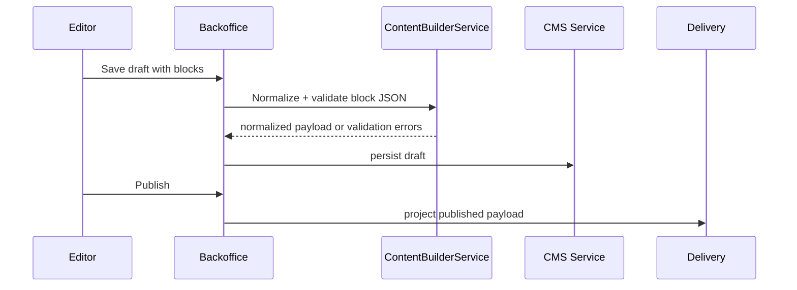

---
tags:
  - CMS
---

# Content Builder

Content Builder is ArcHub's structured block system. Editors compose pages from typed
JSON blocks; the platform validates, normalizes and renders them to public HTML or
delivery JSON.

## Block Groups

| Group | Examples |
|---|---|
| page structure | hero, feature grid, metrics, workflow steps |
| editorial | rich text, quote, FAQ, call to action |
| media | image/media block, download, embed |
| knowledge | RAG reference, expert list, API action |
| commerce/demo | token plans, marketplace cards |

## Editing Flow



Draft save and publish use the same registry, so invalid blocks never reach the
published projection.

## Block Contract

A block declares:

- type id;
- display label and group;
- field schema;
- default values;
- required flags;
- editor hints;
- renderer behavior.

Payload example:

```json
{
  "blocks": [
    {
      "type": "hero",
      "props": {
        "title": "ArcHub Platform",
        "subtitle": "Knowledge, CMS and ITSM in one runtime"
      }
    }
  ]
}
```

## Delivery Behavior

Published blocks appear in:

```http
GET /cms/api/content/{path}
GET /cms/api/search?q=...
GET /cms
```

HTML rendering escapes untrusted values and emits deterministic output for cacheable
delivery. API consumers can also render the JSON themselves.

## Extension Points

Plugins can add macros, renderers, importers and editors. Keep block-specific storage
inside normal content payloads unless the block needs an audited plugin repository.
See [Plugins & Extensibility](capabilities/plugins.md).

## Operational Notes

- Treat block type ids as stable public contracts.
- Add migrations for renamed fields; do not silently drop old properties.
- Keep large binary assets in the media/DAM flow, not inside block JSON.
- Include block examples in plugin or feature documentation.
