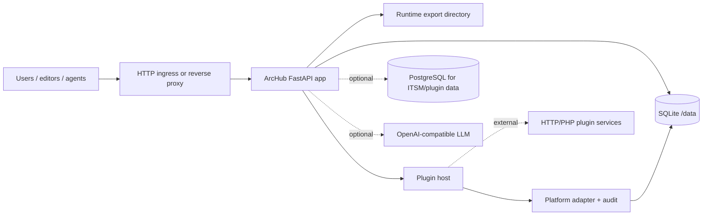

---
tags:
  - Deployment
  - Architecture
---

# Deployment Map

ArcHub is one platform package with several deployment shapes. Start with the
smallest shape that satisfies storage, concurrency and governance requirements; promote
the same artifacts into Docker or Kubernetes when needed.

## Decision Matrix

| Scenario | Storage | Plugins | Best for | Guide |
|---|---|---|---|---|
| Embedded FastAPI library | host-owned | selected routers | existing Python product | [Local](local.md#embed-in-another-fastapi-app) |
| Source checkout | SQLite | repo `plugins/` | development and demos | [Local](local.md) |
| Release wheelhouse | SQLite/PostgreSQL | installed archives | VM or offline install | [Release Artifacts](release-artifacts.md) |
| Docker Compose | SQLite volume or ITSM PG | bundled + external services | reproducible single node | [Docker](docker.md) |
| Kubernetes | PVC + optional managed PG | marketplace modules | cluster operations | [Kubernetes](kubernetes.md) |
| GitHub Pages | static site only | none | documentation publishing | [GitHub Pages](github-pages.md) |

## Runtime Components



## Local Source

Use this while changing code or documentation:

```bash
python -m pip install -e ".[server,postgres,docs,test]"
uvicorn archub_cms.app:create_archub_app --factory --host 127.0.0.1 --port 8088
```

## Release Promotion

Use a release bundle when operators should not need a source checkout:

```bash
python -m pip install --no-index --find-links ./wheelhouse \
  "archub-cms[server,postgres]==0.1.0"

archub-marketplace-build --output dist/archub-marketplace --json
```

Promotion order:

1. platform package;
2. SDK package for automation;
3. marketplace modules and plugin images;
4. docs site from the same tag.

## Container Promotion

```bash
docker build -t registry.example.com/archub-platform:0.1.0 .
docker compose up --build
kubectl apply -f deploy/kubernetes/archub-platform.yaml
```

Compose is the quickest operational smoke test; Kubernetes is the cluster target.

## Storage Guidance

| Need | Storage |
|---|---|
| single writer, small team | SQLite on `/data` |
| many ITSM agents | `ARCHUB_ITSM_PG_DSN` |
| multiple app replicas | PostgreSQL-backed plugin contexts and one background worker |
| sealed environment | local wheelhouse, offline LLM, internal PlantUML or pre-rendered diagrams |

## Air-Gapped Operations

ArcHub's default mode is offline-friendly: SQLite, local runtime export and
`ARCHUB_LLM_PROVIDER=offline-extractive`. For sealed environments, promote a local
wheelhouse, marketplace archives and container images through the approved artifact
channel; point PlantUML at an internal server or pre-render diagrams.

## Background Jobs

Set `ARCHUB_BACKGROUND_JOBS=true` for scheduled jobs, webhook dispatch and runtime
upkeep. In clustered deployments run it on exactly one deployment/replica to avoid
duplicate dispatch.

## Health and Observability

| Endpoint | Use |
|---|---|
| `/api/docs` | liveness/readiness probe |
| `/api/platform/report` | runtime capability and health snapshot |
| `/api/platform/plugins` | plugin status and extension inventory |
| `/api/platform/modules/marketplace` | marketplace catalog check |

## Next Steps

- Start locally: [Local Deployment](local.md).
- Use release artifacts: [Release Artifacts](release-artifacts.md).
- Containerize: [Docker & Compose](docker.md).
- Operate in a cluster: [Kubernetes](kubernetes.md).
