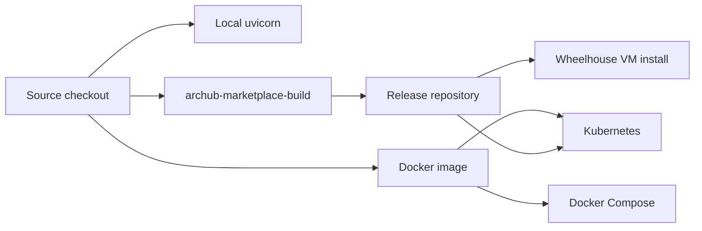

---
tags:
  - CMS
  - ITSM
  - Plugins
  - Deployment
---

# ArcHub Platform

ArcHub is a self-hosted platform for **knowledge bases**, **headless CMS delivery**,
**ITSM/ITIL service management** and **plugin-based extensions**. It runs as a
FastAPI package, a standalone container, or a Kubernetes workload, and it can operate
offline with SQLite and extractive answers.

<div class="grid cards" markdown>

- :material-rocket-launch: **[Start locally](getting-started.md)**  
  Run the platform, backoffice, ITSM and plugin host on a laptop.

- :material-package-variant-closed: **[Install releases](deployment/release-artifacts.md)**  
  Use wheels, SDK packages, marketplace archives and container tags.

- :material-puzzle: **[Plugins & marketplace](plugins/index.md)**  
  Discover core modules, Python plugins and external PHP services.

- :material-kubernetes: **[Kubernetes](deployment/kubernetes.md)**  
  Deploy with PVCs, probes, ConfigMaps and optional managed PostgreSQL.

- :material-file-document-multiple: **[Docs as Code](handbook/docs-as-code.md)**  
  Author this wiki with search, tags, diagrams and strict builds.

- :material-sitemap: **[Architecture](architecture/c4-model.md)**  
  Read C4, DDD, PlantUML, Mermaid, Structurizr and Archi models.

</div>

## Platform Pillars

| Pillar | What ships |
|---|---|
| Knowledge platform | spaces, wiki-style graph, search, offline/online LLM answers, Obsidian export |
| Headless CMS | content models, Content Builder, publish workflow, preview, delivery API, RSS/sitemap |
| ITSM / ITIL | Service Desk, request lifecycle, catalog, SLA, CMDB and BPMN workflow schemes |
| Plugin runtime | manifest validation, extension points, marketplace packaging, audited storage adapters |
| SDK & automation | dependency-free Python SDK and OpenAPI subset for platform workflows |

## Deployment Paths



Use [Deployment Map](deployment/scenarios.md) to choose the runtime shape.

## Reader Routes

| If you are... | Start with |
|---|---|
| evaluating the product | [Use Cases](use-cases.md) and [Platform Comparison](comparison.md) |
| running it locally | [Getting Started](getting-started.md) |
| packaging releases | [Release Artifacts](deployment/release-artifacts.md) |
| operating containers | [Docker & Compose](deployment/docker.md) or [Kubernetes](deployment/kubernetes.md) |
| extending the platform | [Plugin Catalog](plugins/index.md) and [Plugins & Extensibility](capabilities/plugins.md) |
| integrating automation | [Platform SDK](sdk/platform-sdk.md) and [HTTP API](reference/api.md) |
| maintaining docs | [Documentation System](handbook/docs-as-code.md) |

## Default Stack

```text
FastAPI app
  ├─ SQLite CMS database: data/archub_cms.db
  ├─ Runtime export: data/archub_runtime
  ├─ Plugin manifests: plugins/
  ├─ Offline-extractive LLM provider
  └─ Optional PostgreSQL for ITSM/plugin data
```

Start:

```bash
python -m pip install -e ".[server,postgres,docs]"
uvicorn archub_cms.app:create_archub_app --factory --host 127.0.0.1 --port 8088
```

Build docs:

```bash
properdocs build --strict --site-dir site
```
